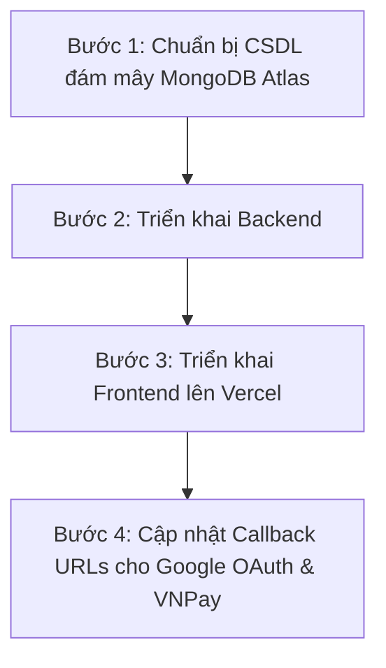

# 🚀 HƯỚNG DẪN TRIỂN KHAI (DEPLOY) DỰ ÁN ELECTRONICS E-COMMERCE

Tài liệu này cung cấp kế hoạch chi tiết từng bước để triển khai (deploy) toàn bộ dự án **Electronics E-Commerce** từ môi trường phát triển cục bộ (localhost) lên các nền tảng đám mây để chạy demo thực tế.

---

## 📌 1. Phân Tích Kiến Trúc Dự Án Hiện Tại

Dự án của bạn là một ứng dụng **Full-stack tách biệt**:
*   **Frontend (`/client`)**: Xây dựng bằng React + Vite + TypeScript + Tailwind CSS. Đây là ứng dụng dạng SPA (Single Page Application) chạy hoàn toàn trên trình duyệt sau khi build ra các file tĩnh.
*   **Backend (`/backend`)**: Xây dựng bằng Node.js + Express.js + Mongoose kết nối với MongoDB. Chạy như một REST API server liên tục.
*   **Dịch vụ bên thứ ba**: MongoDB (Cơ sở dữ liệu), Cloudinary (Lưu trữ ảnh), Google OAuth (Đăng nhập mạng xã hội), VNPay (Cổng thanh toán), Nodemailer (Gửi email).

---

## ⚡ 1.5. Đã Tối Ưu Hóa Codebase Trước Khi Deploy (Rất Quan Trọng!)

Thông thường, khi deploy một dự án Full-stack lên production, các nhà phát triển hay gặp lỗi cấu hình hoặc các lỗi "chí mạng" liên quan đến môi trường chạy. Tôi đã **chủ động rà soát sâu toàn bộ codebase** và đã giúp bạn sửa đổi thành công 4 điểm nghẽn nghiêm trọng sau:

1.  **Google OAuth Callback Redirect (`backend/src/routes/authRoutes.js`):**
    *   *Trước đây:* Hardcode chuyển hướng thành công về `http://localhost:5173/oauth-success`.
    *   *Hiện tại:* Đã được cập nhật động sử dụng `process.env.FRONTEND_URL` và tự động fallback về localhost nếu chạy môi trường phát triển cục bộ.
2.  **Đường dẫn đặt lại mật khẩu trong email (`backend/src/controllers/authController.js`):**
    *   *Trước đây:* Link reset mật khẩu gửi qua email bị hardcode thành `http://localhost:5173/reset-password/...`.
    *   *Hiện tại:* Đã cập nhật thành công thành sử dụng động biến `process.env.FRONTEND_URL`.
3.  **Cấu hình Custom DNS (`backend/src/server.js`):**
    *   *Trước đây:* Chạy trực tiếp `dns.setServers(["1.1.1.1", "8.8.8.8"])`. Khi đưa lên hosting đám mây (Render/Vercel), dòng này có thể gây lỗi phân giải tên miền nội bộ của cloud provider hoặc crash server do không đủ quyền ghi cấu hình DNS của hệ thống container.
    *   *Hiện tại:* Đã bọc an toàn trong điều kiện chỉ kích hoạt khi `NODE_ENV !== "production"` kèm theo khối `try-catch` để phòng chống lỗi tuyệt đối.
4.  **Cấu hình Trust Proxy cho Google OAuth (`backend/src/config/passport.js`):**
    *   *Trước đây:* Thiếu tham số tin cậy proxy (`proxy: true`). Khi Express chạy sau hạ tầng Proxy của Render/Vercel, Google Passport sẽ tự sinh callback URL dạng `http://...` thay vì `https://...`, dẫn đến lỗi khóa bảo mật của Google.
    *   *Hiện tại:* Đã thêm thuộc tính `proxy: true` để luôn đảm bảo luồng chuyển hướng sử dụng HTTPS bảo mật.

Những thay đổi này giúp codebase của bạn đạt tiêu chuẩn **"Cloud-ready"** thực thụ!

---

## 📌 2. Kế Hoạch Triển Khai Chi Tiết

Để ứng dụng hoạt động trơn tru trong thực tế, chúng ta sẽ thực hiện theo 4 bước lớn:



---

## 📂 BƯỚC 1: CHUẨN BỊ CƠ SỞ DỮ LIỆU ĐÁM MÂY (MONGODB ATLAS)
Hiện tại, dự án của bạn có thể đang dùng MongoDB chạy local. Khi đưa lên internet, chúng ta cần một database đám mây.

1.  Truy cập [MongoDB Atlas](https://www.mongodb.com/cloud/atlas) và đăng ký tài khoản miễn phí.
2.  Tạo một **Cluster** mới (chọn gói Shared FREE).
3.  **Cấu hình bảo mật**:
    *   Tạo một Database User (lưu lại username và password).
    *   Trong mục **IP Access List (Network Access)**, thêm IP `0.0.0.0/0` để cho phép backend từ mọi nơi (Vercel/Render) truy cập được (hoặc cấu hình cụ thể hơn nếu cần).
4.  Lấy đường dẫn kết nối (**Connection String**):
    *   Bấm **Connect** -> Chọn **Drivers** (Node.js).
    *   Đường dẫn sẽ có dạng: `mongodb+srv://<username>:<password>@cluster0.xxxx.mongodb.net/electronics_db?retryWrites=true&w=majority`
    *   Thay `<username>` và `<password>` bằng thông tin bạn vừa tạo ở trên.

---

## 📂 BƯỚC 2: TRIỂN KHAI BACKEND (EXPRESS APP)

Chúng ta có **2 phương án** để triển khai phần Backend này. Hãy chọn phương án phù hợp nhất với nhu cầu demo của bạn:

---

### 💡 Phương án A: Triển khai lên Render.com (Khuyến nghị - Ổn định & Dễ nhất)
Render.com cung cấp dịch vụ hosting Node.js truyền thống hoàn toàn miễn phí, chạy liên tục và cực kỳ ổn định mà không cần chỉnh sửa code Node.js hiện tại của bạn.

#### Các bước thực hiện:
1.  **Đưa dự án lên GitHub**: Hãy đẩy toàn bộ source code dự án lên một kho lưu trữ (repository) GitHub riêng tư hoặc công khai.
2.  **Đăng ký Render**: Truy cập [Render.com](https://render.com) và đăng nhập bằng tài khoản GitHub của bạn.
3.  **Tạo Web Service mới**:
    *   Bấm **New +** -> Chọn **Web Service**.
    *   Kết nối với repository GitHub chứa dự án của bạn.
4.  **Cấu hình thông số Web Service**:
    *   **Name**: `electronics-backend-demo` (tùy chọn)
    *   **Root Directory**: `backend` (Rất quan trọng! Vì code backend nằm trong thư mục này)
    *   **Language**: `Node`
    *   **Build Command**: `npm install` (hoặc `pnpm install` nếu bạn dùng pnpm)
    *   **Start Command**: `npm start`
5.  **Cấu hình Environment Variables (Biến môi trường)**:
    Mở mục **Advanced** -> Thêm các biến môi trường sau từ file `.env` cục bộ của bạn:
    *   `PORT` = `10000` (Render tự động cấp port, nhưng đặt mặc định 10000)
    *   `MONGO_URI` = *(Đường dẫn MongoDB Atlas bạn lấy ở Bước 1)*
    *   `JWT_SECRET` = *(Khóa bí mật JWT của bạn)*
    *   `EMAIL_USER` = *(Gmail gửi OTP)*
    *   `EMAIL_PASS` = *(Mật khẩu ứng dụng Gmail)*
    *   `CLOUDINARY_CLOUD_NAME` = *(Lấy từ Cloudinary)*
    *   `CLOUDINARY_API_KEY` = *(Lấy từ Cloudinary)*
    *   `CLOUDINARY_API_SECRET` = *(Lấy từ Cloudinary)*
    *   `GOOGLE_CLIENT_ID` = *(Google OAuth Client)*
    *   `GOOGLE_CLIENT_SECRET` = *(Google OAuth Secret)*
    *   `VNPAY_TMN_CODE` = *(VNPay)*
    *   `VNPAY_HASH_SECRET` = *(VNPay)*
    *   `VNPAY_URL` = `https://sandbox.vnpayment.vn/paymentv2/vpcpay.html`
    *   `FRONTEND_URL` = *(Sẽ cập nhật sau khi deploy xong Frontend)*
6.  Bấm **Deploy Web Service** và chờ Render build. Sau khi hoàn thành, bạn sẽ có URL backend dạng: `https://electronics-backend-demo.onrender.com`.

> [!NOTE]
> **Nhược điểm gói FREE của Render:** Nếu không có lượt truy cập nào trong 15 phút, server sẽ tự động "ngủ" để tiết kiệm tài nguyên. Khi có người truy cập lại, sẽ mất khoảng 30 - 50 giây để server khởi động lại (Cold Start). Đây là điều hoàn toàn bình thường đối với các tài khoản miễn phí và vẫn hoàn hảo cho việc demo.

---

### 💡 Phương án B: Triển khai Backend lên Vercel Serverless (Gom tất cả về Vercel)
Nếu bạn muốn demo của mình chạy cực nhanh, không bao giờ bị "ngủ" sâu như Render, và quản lý mọi thứ tập trung trên Vercel, bạn có thể chạy Backend Express dưới dạng **Serverless Functions** của Vercel.

#### Các bước thực hiện:
1.  **Tạo file entrypoint Serverless**:
    Tạo một file mới tại đường dẫn `backend/api/index.js` để làm cổng tiếp nhận request cho Vercel:

    ```javascript
    // backend/api/index.js
    import app from "../src/app.js";
    import mongoose from "mongoose";
    import env from "../src/config/env.js";

    // Quản lý kết nối Database tối ưu cho môi trường Serverless (tránh cạn kiệt pool)
    let isConnected = false;

    const connectDB = async () => {
      if (isConnected) return;
      try {
        const db = await mongoose.connect(env.MONGO_URI);
        isConnected = db.connections[0].readyState;
        console.log("MongoDB connected for serverless function");
      } catch (error) {
        console.error("MongoDB connection error:", error.message);
      }
    };

    export default async function handler(req, res) {
      // Kết nối database trước khi xử lý request
      await connectDB();
      
      // Chuyển quyền xử lý cho Express app
      return app(req, res);
    }
    ```

2.  **Cấu hình Vercel Routing**:
    Tạo file cấu hình `backend/vercel.json` để định tuyến toàn bộ API request về file entrypoint trên:

    ```json
    {
      "version": 2,
      "builds": [
        {
          "src": "api/index.js",
          "use": "@vercel/node"
        }
      ],
      "routes": [
        {
          "source": "/(.*)",
          "destination": "api/index.js"
        }
      ]
    }
    ```

3.  **Deploy backend lên Vercel**:
    *   Đăng nhập vào [Vercel](https://vercel.com).
    *   Bấm **Add New** -> **Project**.
    *   Chọn repository GitHub của bạn.
    *   Trong phần cài đặt dự án:
        *   **Framework Preset**: Chọn `Other`
        *   **Root Directory**: Điền `backend`
    *   Thêm đầy đủ các biến môi trường vào mục **Environment Variables** (giống danh sách ở Phương án A).
    *   Bấm **Deploy**. Bạn sẽ nhận được URL Backend Vercel dạng: `https://your-backend-project.vercel.app`.

---

## 📂 BƯỚC 3: TRIỂN KHAI FRONTEND (CLIENT) LÊN VERCEL
Vercel là nền tảng tối ưu và tốt nhất hiện nay để chạy các ứng dụng React Vite SPA.

1.  **Tránh lỗi 404 khi F5/Reload trang**:
    Các ứng dụng React Router DOM sử dụng cơ chế định tuyến phía Client. Khi bạn F5 trang ở đường dẫn ví dụ `/admin/dashboard`, Vercel sẽ cố tìm file tĩnh `/admin/dashboard/index.html` và báo lỗi 404.
    Để xử lý triệt để, hãy tạo file `client/vercel.json` trước khi deploy:

    ```json
    {
      "rewrites": [
        {
          "source": "/(.*)",
          "destination": "/index.html"
        }
      ]
    }
    ```

2.  **Deploy lên Vercel**:
    *   Truy cập Dashboard Vercel, chọn **Add New** -> **Project**.
    *   Chọn repository GitHub của bạn.
    *   Cấu hình dự án:
        *   **Framework Preset**: Chọn `Vite` (Vercel sẽ tự động phát hiện và tối ưu cấu hình build).
        *   **Root Directory**: Điền `client` (Rất quan trọng!)
        *   **Build Command**: `npm run build`
        *   **Output Directory**: `dist`
3.  **Cấu hình Biến Môi Trường (Environment Variables)**:
    Thêm biến môi trường trỏ đến URL Backend mà bạn vừa deploy ở **Bước 2**:
    *   `VITE_API_URL` = `https://your-backend-url.onrender.com` (hoặc URL Vercel Backend nếu dùng Phương án B).
4.  Bấm **Deploy**. Trình duyệt sẽ tự động build và cấp cho bạn một URL Frontend chạy chính thức (ví dụ: `https://electronics-shop-demo.vercel.app`).

---

## 📂 BƯỚC 4: ĐỒNG BỘ HÓA BẢO MẬT & ĐĂNG NHẬP / THANH TOÁN (QUAN TRỌNG)

Khi dự án đã chạy online với URL thực tế, các dịch vụ OAuth và thanh toán cần được cập nhật cấu hình để tránh bị lỗi từ chối kết nối (CORS / Redirect URI mismatch):

### 1. Cấu hình lại Google Cloud Console (Để đăng nhập Google hoạt động)
*   Truy cập [Google Cloud Console Credentials](https://console.cloud.google.com/apis/credentials).
*   Chọn dự án của bạn và mở mục **OAuth 2.0 Client IDs**.
*   **Authorized JavaScript origins**: Thêm URL Frontend của bạn (ví dụ: `https://electronics-shop-demo.vercel.app`).
*   **Authorized redirect URIs**: Thêm đường dẫn callback thực tế của backend:
    `https://your-backend-url.onrender.com/api/auth/google/callback`

### 2. Cập nhật lại Biến Môi Trường cho Backend
Mở phần cấu hình biến môi trường trên Render/Vercel Backend và cập nhật các giá trị sau:
*   `FRONTEND_URL` = `https://electronics-shop-demo.vercel.app` (URL Frontend thực tế trên Vercel).
*   `VNPAY_RETURN_URL` = `https://your-backend-url.onrender.com/api/payment/vnpay_return` (Hoặc URL backend tương ứng để VNPay trả kết quả giao dịch về).

Sau khi cập nhật biến môi trường, hãy thực hiện **Redeploy** backend để các thay đổi có hiệu lực.

---

## 🛠️ BẢNG TỔNG HỢP KIỂM TRA (CHECKLIST) DEPLOY

| Bước | Nội Dung Kiểm Tra | Trạng Thái |
| :--- | :--- | :---: |
| 1 | Đã cấu hình MongoDB Atlas và có Connection String | `[ ]` |
| 2 | Đã cấu hình IP Access List `0.0.0.0/0` trên Atlas | `[ ]` |
| 3 | Đã thêm file `client/vercel.json` để tránh lỗi 404 | `[ ]` |
| 4 | Đã deploy thành công Backend lên Render hoặc Vercel | `[ ]` |
| 5 | Đã deploy thành công Frontend lên Vercel | `[ ]` |
| 6 | Đã cập nhật `VITE_API_URL` ở Frontend trỏ về URL Backend thực | `[ ]` |
| 7 | Đã cập nhật `FRONTEND_URL` và `VNPAY_RETURN_URL` ở Backend | `[ ]` |
| 8 | Đã cập nhật Authorized Redirect URIs trong Google Console | `[ ]` |
| 9 | Test thử đăng ký, đăng nhập và thanh toán trên trang Live | `[ ]` |

---
*Chúc bạn triển khai dự án thành công tốt đẹp! Nếu bạn gặp bất kỳ lỗi nào trong quá trình thực hiện cấu hình trên, hãy gửi log lỗi ở đây để tôi hỗ trợ xử lý ngay lập tức.*
